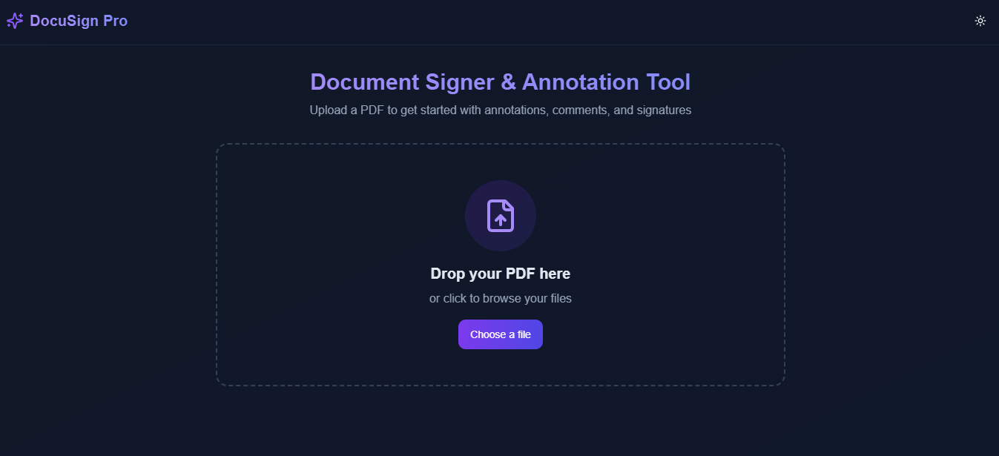

# DocuSign Pro - PDF Document Signer & Annotation Tool

DocuSign Pro is a modern web application that allows users to upload, view, annotate, and sign PDF documents directly in the browser. Built with Next.js, React, and Tailwind CSS, it provides a sleek and intuitive interface for working with PDF documents.



## Features

- **PDF Viewing**: Upload and view PDF documents with smooth page navigation.
- **Annotation Tools**: Add highlights, underlines, and comments to documents.
- **Digital Signatures**: Create and place digital signatures on documents.
- **Customizable**: Choose from multiple colors for annotations.
- **Responsive Design**: Works on desktop and mobile devices.
- **Dark Mode**: Toggle between light and dark themes.
- **Export**: Export annotated documents (mock implementation).

## Tech Stack

- **Framework**: Next.js 14 (App Router)
- **UI Library**: React 18
- **Styling**: Tailwind CSS
- **UI Components**: shadcn/ui
- **PDF Processing**: react-pdf (PDF.js)
- **Animations**: Framer Motion
- **Icons**: Lucide React
- **Signature Capture**: react-signature-canvas
- **File Handling**: react-dropzone

## Getting Started

### Prerequisites

- Node.js 18.x or higher
- npm or yarn

### Installation

1. Clone the repository:
   ```bash
   git clone https://github.com/obiajulu-gif/document-signer.git
   cd document-signer
   ```
2. Install dependencies:
   ```bash
   npm install
   ```
3. Run the development server:
   ```bash
   npm run dev
   ```
4. Open [http://localhost:3000](http://localhost:3000) in your browser.

## Usage

### Document Upload
- Users can upload PDF documents.
- Drag-and-drop functionality and file selection dialog are supported.
- Uploaded documents are displayed in the viewport.

### Annotation Features
- Highlight text with customizable colors.
- Underline text with customizable colors.
- Add comments attached to specific parts of the document.
- Draw signatures anywhere on the document.

### Document Export
- Users can export the annotated document as a PDF.
- All annotations and signatures are properly embedded in the exported PDF.
- Exported documents maintain the quality of the original.


## Contact

For any inquiries or collaboration requests, please contact **okoyeemmanuelobiajulu@gmail.com**.

